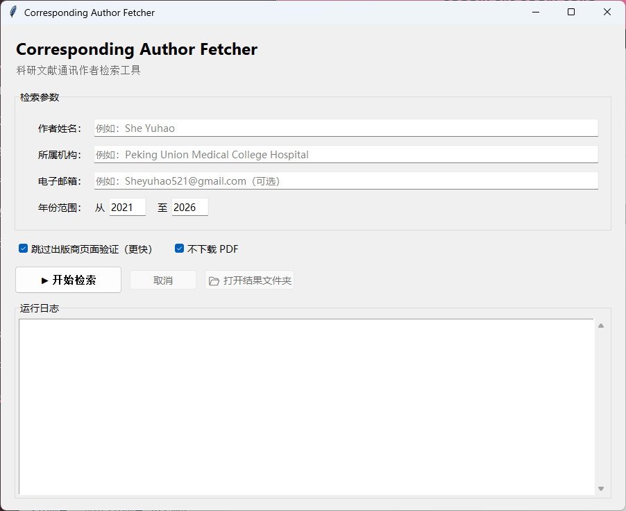

# Corresponding Author Fetcher

此工具可以用来检索某位作者作为通讯作者发表的文献

---

## Demo

GUI interface:

---

## 主要功能

目前支持以下功能：

### 多数据库检索

支持从以下公开数据库获取论文信息：

- OpenAlex
- Crossref
- Europe PMC
- Semantic Scholar

### 通讯作者识别

根据以下信息辅助判断通讯作者：

- 作者姓名
- 机构信息（Institution）
- 邮箱信息（Email）
- 文献元数据中的作者贡献信息

### 论文筛选

支持：

- 时间范围筛选
- 作者信息匹配
- 通讯作者证据判断

### 开放获取论文下载

支持下载合法公开获取（Open Access）的 PDF 文件。

本项目不会绕过付费墙或访问受限制资源。

### 数据导出

支持导出：

- CSV 文件
- JSON 文件
  

---

## 使用方法

运行python corresponding_author_fetcher.py（或.exe）
输入：
1.作者英文名（如she yuhao）
2.作者隶属单位（如peking union medical college hospital）
3.作者邮箱（如sheyuhao521@gmail.com，可省略，但不建议省略）
4.起始时间（如2024，可省略）
5.终止时间（如2026，可省略）

---

## License

MIT License

---

## Author

GitHub:
https://github.com/sheyuhao521